# Architecture Overview

This document describes the high-level architecture of the vingt-et-un (blackjack) game.

## Build Structure

The project uses CMake and produces three targets:

- `cardgames` - Static library containing all game logic
- `blackjack` - Console executable that provides the interactive game
- `blackjack-qml` - Qt Quick GUI application (optional, requires Qt 6.8+)

```
src/
├── CMakeLists.txt           # Defines cardgames library and blackjack executable
├── card.h                   # Card value type
├── deck.h / deck.cpp        # Deck container and operations
├── blackjack-game.h / blackjack-game.cpp  # Game state machine
├── streaming.h / streaming.cpp  # I/O utilities
├── CompileTimeChecks.h      # Type trait utilities
├── test-decks.h / test-decks.cpp  # Deterministic decks for testing
└── main.cpp                 # Console game loop and I/O handling

app/qml/
├── CMakeLists.txt           # QML executable and tests
├── GameController.h / GameController.cpp  # Q_OBJECT wrapper for Game
├── Main.qml                 # Main window layout
├── CardView.qml             # Single card display component
├── HandView.qml             # Row of cards component
└── Theme.qml                # Styling constants

test/
├── CMakeLists.txt           # Test executable using Catch2
├── card_tests.cpp           # Card unit tests
├── deck_tests.cpp           # Deck unit tests
├── streaming_tests.cpp      # I/O tests
└── game_tests.cpp           # Game state machine tests
```

## Namespace Organization

```
(global)
├── Card                    # struct with nested Suit/Rank enums
├── Deck                    # class
├── shuffle()               # free function
├── slice_suits()           # free function
├── slice_face_values()     # free function
└── CardGames::BlackJack
    ├── HandValue           # struct (hand calculation result)
    ├── DealersHand         # class (dealer's hand container)
    ├── PlayersHand         # class (player's hands with split support)
    ├── PlayersHand::SingleHand  # struct (individual hand data)
    ├── GameNode            # enum class (state identifiers)
    ├── GameState           # struct (immutable state snapshot)
    ├── BlackjackConfig     # struct (game rule configuration)
    ├── Game                # class (state machine)
    ├── Game::Play          # enum class (player actions)
    ├── calculate_hand_value()  # free function (soft ace logic)
    └── add_em_up()         # free function (hand total)
```

## Class Diagram

```mermaid
classDiagram
    class Card {
        +Suit suit
        +Rank rank
        +Card()
        +Card(Rank, Suit)
        +Card(Suit, Rank)
        +suits()$ vector~Suit~
    }

    class Card_Suit {
        <<enumeration>>
        Clubs
        Diamonds
        Hearts
        Spades
    }

    class Card_Rank {
        <<enumeration>>
        Two = 2
        Three = 3
        ...
        King = 13
        Ace = 14
    }

    class Deck {
        -vector~Card~ m_cards
        +Deck()
        +Deck(vector~Card~)
        +cards() vector~Card~
        +deal() Card
        +deal(size_t) vector~Card~
        +begin() iterator
        +end() iterator
    }

    class HandValue {
        +int total
        +bool is_soft
        +int soft_ace_count
    }

    class DealersHand {
        -vector~Card~ m_cards
        +cards() vector~Card~
        +add(Card)
        +value() HandValue
        +total() int
        +is_soft() bool
    }

    class PlayersHand {
        -vector~SingleHand~ m_hands
        -size_t m_active_index
        +active_cards() vector~Card~
        +add_to_active(Card)
        +active_total() int
        +active_is_busted() bool
        +can_split(bool) bool
        +split(Card, Card)
        +mark_active_complete()
        +advance_to_next_incomplete() bool
        +all_complete() bool
        +all_busted() bool
        +hand_count() size_t
        +active_index() size_t
        +all_hands() vector~SingleHand~
    }

    class SingleHand {
        +vector~Card~ cards
        +bool is_from_split
        +bool is_from_split_aces
        +bool is_complete
        +int split_count
    }

    class GameState {
        -GameNode m_node
        -PlayersHand m_players_hand
        -DealersHand m_dealers_hand
        -Deck m_deck
        +node() GameNode
        +players_hand() PlayersHand
        +dealer_hand() DealersHand
        +deck() Deck
        +can_split(bool) bool
    }

    class BlackjackConfig {
        +bool hit_soft_17
        +bool allow_resplit_aces
        +optional~Deck~ initial_deck
    }

    class Game {
        -BlackjackConfig m_config
        -vector~GameState~ history
        +Game(BlackjackConfig)
        +next(Play) GameState
        +state() GameState
        -play_dealer_turn()
    }

    class Game_Play {
        <<enumeration>>
        Deal
        Hit
        Stay
        Split
    }

    class GameNode {
        <<enumeration>>
        Ready
        PlayersRound
        PlayersSplitRound
        DealersRound
        GameOverPlayerBusts
        GameOverPlayerWins
        GameOverDealerBusts
        GameOverDealerWins
        GameOverDraw
    }

    class GameController {
        -Game m_game
        +version() QString
        +gameState() QString
        +playerHand() QVariantList
        +dealerHand() QVariantList
        +playerScore() int
        +dealerScore() int
        +canDeal() bool
        +canHit() bool
        +canStay() bool
        +canSplit() bool
        +isGameOver() bool
        +isSplitRound() bool
        +handCount() int
        +activeHandIndex() int
        +playerHands() QVariantList
        +resultMessage() QString
        +deal()
        +hit()
        +stay()
        +split()
        +newGame(QString)
    }

    Card --> Card_Suit
    Card --> Card_Rank
    Deck --> Card : contains
    DealersHand --> Card : contains
    DealersHand --> HandValue : returns
    PlayersHand --> SingleHand : contains
    SingleHand --> Card : contains
    GameState --> GameNode
    GameState --> PlayersHand
    GameState --> DealersHand
    GameState --> Deck
    Game --> GameState : history
    Game --> Game_Play
    Game --> BlackjackConfig
    GameController --> Game : wraps
```



## Key Relationships

| Component | Depends On | Purpose |
|-----------|------------|---------|
| `Deck` | `Card` | Container for 52 cards with deal operations |
| `DealersHand` | `Card`, `HandValue` | Dealer's hand with value calculation |
| `PlayersHand` | `Card`, `SingleHand` | Player's hands with split support |
| `GameState` | `Deck`, `PlayersHand`, `DealersHand`, `GameNode` | Immutable snapshot of game at a point in time |
| `Game` | `GameState`, `BlackjackConfig` | State machine that manages transitions via history |
| `GameController` | `Game` | Qt wrapper exposing game to QML |

## QML Component Hierarchy

```
Main.qml (ApplicationWindow)
├── GameController (instantiated as 'game')
├── ColumnLayout (game area)
│   ├── Dealer section
│   │   ├── Label ("Dealer")
│   │   ├── Text (score)
│   │   └── HandView (dealer cards)
│   ├── Label (status message)
│   └── Player section
│       ├── Label ("Your Hand" / "Your Hands")
│       ├── Single hand display (when handCount <= 1)
│       │   ├── Text (score)
│       │   └── HandView (player cards)
│       └── Multiple hands display (when handCount > 1)
│           └── Repeater over playerHands
│               └── Row with hand indicator, score, status, HandView
└── Column (button panel)
    ├── Button ("New Game")
    ├── Button ("Stay")
    ├── Button ("Hit me")
    └── Button ("Split")
```

## File References

- Card definition: `src/card.h:7-57`
- Deck definition: `src/deck.h:12-96`
- HandValue struct: `src/blackjack-game.h:13-23`
- DealersHand class: `src/blackjack-game.h:29-49`
- PlayersHand class: `src/blackjack-game.h:51-152`
- GameNode enum: `src/blackjack-game.h:154-164`
- GameState struct: `src/blackjack-game.h:166-204`
- BlackjackConfig struct: `src/blackjack-game.h:206-211`
- Game class: `src/blackjack-game.h:213-235`
- Game::next() implementation: `src/blackjack-game.cpp:46-202`
- play_dealer_turn(): `src/blackjack-game.cpp:204-239`
- GameController: `app/qml/GameController.h:12-68`
