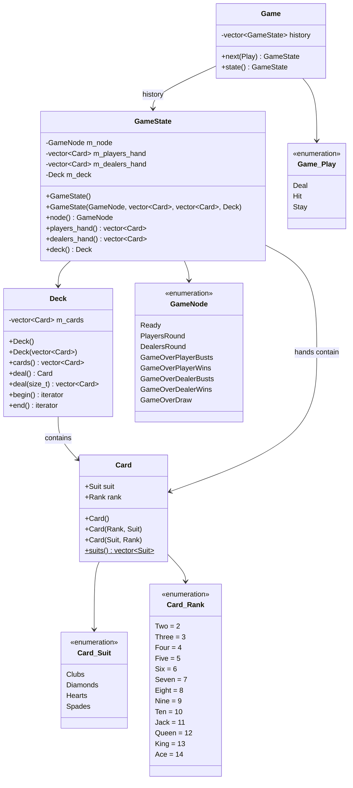

# Architecture Overview

This document describes the high-level architecture of the vingt-et-un (blackjack) game.

## Build Structure

The project uses CMake and produces two targets:

- `cardgames` - Static library containing all game logic
- `blackjack` - Executable that provides the interactive game

```
src/
├── CMakeLists.txt      # Defines cardgames library and blackjack executable
├── card.h              # Card value type
├── deck.h / deck.cpp   # Deck container and operations
├── blackjack-game.h / blackjack-game.cpp  # Game state machine
├── streaming.h / streaming.cpp  # I/O utilities
├── CompileTimeChecks.h # Type trait utilities
└── main.cpp            # Game loop and I/O handling

test/
├── CMakeLists.txt      # Test executable using Catch2
├── deck_tests.cpp      # Deck unit tests
└── game_tests.cpp      # Game state machine tests
```

## Namespace Organization

```
(global)
├── Card                    # struct with nested Suit/Rank enums
├── Deck                    # class
├── shuffle()               # free function
├── slice_suits()           # free function
├── slice_face_values()     # free function
└── CardGames::BlackJack
    ├── GameNode            # enum class (state identifiers)
    ├── GameState           # struct (immutable state snapshot)
    ├── Game                # class (state machine)
    └── add_em_up()         # free function (hand value calculation)
```

## Class Diagram



## Key Relationships

| Component | Depends On | Purpose |
|-----------|------------|---------|
| `Deck` | `Card` | Container for 52 cards with deal operations |
| `GameState` | `Deck`, `Card`, `GameNode` | Immutable snapshot of game at a point in time |
| `Game` | `GameState` | State machine that manages transitions via history |

## File References

- Card definition: `src/card.h:7-45`
- Deck definition: `src/deck.h:12-79`
- GameState definition: `src/blackjack-game.h:21-42`
- Game definition: `src/blackjack-game.h:63-72`
- Game::next() implementation: `src/blackjack-game.cpp:27-106`
