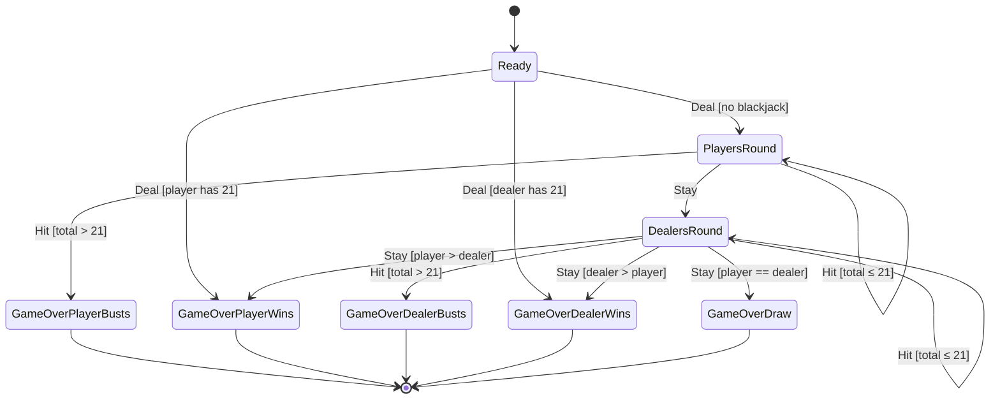

# Game Logic

This document describes the blackjack game state machine and scoring rules.

## State Machine

The game progresses through states defined by `GameNode` enum (`src/blackjack-game.h:10-18`).

## State Transitions

| Current State | Action | Condition | Next State |
|---------------|--------|-----------|------------|
| Ready | Deal | player == 21 | GameOverPlayerWins |
| Ready | Deal | dealer == 21 | GameOverDealerWins |
| Ready | Deal | neither == 21 | PlayersRound |
| PlayersRound | Hit | total ≤ 21 | PlayersRound |
| PlayersRound | Hit | total > 21 | GameOverPlayerBusts |
| PlayersRound | Stay | - | DealersRound |
| DealersRound | Hit | total ≤ 21 | DealersRound |
| DealersRound | Hit | total > 21 | GameOverDealerBusts |
| DealersRound | Stay | player > dealer | GameOverPlayerWins |
| DealersRound | Stay | dealer > player | GameOverDealerWins |
| DealersRound | Stay | player == dealer | GameOverDraw |

## Scoring Rules

Hand values are calculated by `add_em_up()` (`src/blackjack-game.cpp:9-25`):

| Card | Value |
|------|-------|
| 2-10 | Face value (2-10) |
| Jack, Queen, King | 10 |
| Ace | 11 |

**Note:** The current implementation does not handle "soft" aces (counting as 1 when 11 would bust). Aces are always valued at 11.

## Initial Deal

When `Deal` is played from `Ready` state (`src/blackjack-game.cpp:32-51`):

1. Player receives 1 card face down
2. Dealer receives 1 card face down
3. Player receives 1 card face up
4. Dealer receives 1 card face up
5. Check for instant blackjack (21):
   - Player 21 → `GameOverPlayerWins`
   - Dealer 21 → `GameOverDealerWins`
   - Otherwise → `PlayersRound`

## Player Actions

Defined in `Game::Play` enum (`src/blackjack-game.h:66`):

- **Deal** - Start the game, deal initial cards
- **Hit** - Draw another card
- **Stay** - End turn, pass to dealer (or final scoring)

## History Tracking

The `Game` class maintains a `vector<GameState>` history (`src/blackjack-game.h:71`). Each state transition appends a new immutable `GameState` to this history. The current state is always `history.back()`.

## File References

- GameNode enum: `src/blackjack-game.h:10-18`
- GameState struct: `src/blackjack-game.h:21-42`
- Game::next() state machine: `src/blackjack-game.cpp:27-106`
- add_em_up() scoring: `src/blackjack-game.cpp:9-25`
