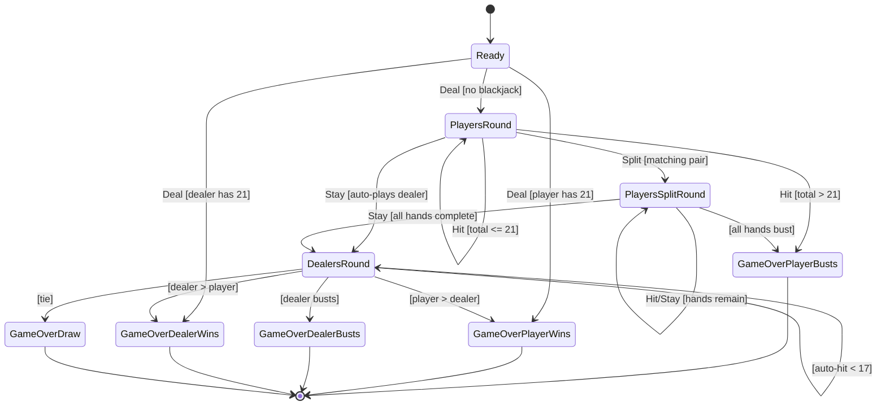

# Game Logic

This document describes the blackjack game state machine and scoring rules.

## State Machine

The game progresses through states defined by `GameNode` enum (`src/blackjack-game.h:27-36`).

## State Transitions

| Current State | Action | Condition | Next State |
|---------------|--------|-----------|------------|
| Ready | Deal | player == 21 | GameOverPlayerWins |
| Ready | Deal | dealer == 21 | GameOverDealerWins |
| Ready | Deal | neither == 21 | PlayersRound |
| PlayersRound | Hit | total <= 21 | PlayersRound |
| PlayersRound | Hit | total > 21 | GameOverPlayerBusts |
| PlayersRound | Stay | - | DealersRound (auto-plays) |
| PlayersRound | Split | matching pair | PlayersSplitRound |
| PlayersSplitRound | Hit | not bust | PlayersSplitRound |
| PlayersSplitRound | Hit | bust | advance to next hand or DealersRound |
| PlayersSplitRound | Stay | hands remain | PlayersSplitRound (next hand) |
| PlayersSplitRound | Stay | all complete | DealersRound (auto-plays) |
| DealersRound | auto | dealer < 17 | DealersRound (hit) |
| DealersRound | auto | dealer >= 17 | GameOver (comparison) |

## Scoring Rules

Hand values are calculated by `calculate_hand_value()` (`src/blackjack-game.cpp:9-39`):

| Card | Value |
|------|-------|
| 2-10 | Face value (2-10) |
| Jack, Queen, King | 10 |
| Ace | 11 (or 1 if 11 would bust) |

### Soft Ace Handling

Aces are counted as 11 initially. If the total exceeds 21 and there are aces counted as 11, they are reduced to 1 one at a time until the total is <= 21 or all aces are counted as 1.

The `HandValue` struct tracks:
- `total` - Final calculated total
- `is_soft` - True if an Ace is currently counted as 11
- `soft_ace_count` - Number of Aces counted as 11

## Hand Class

The `Hand` class (`src/blackjack-game.h:28-71`) wraps a vector of cards and provides:

- `cards()` - Access the underlying cards
- `add(Card)` - Add a card to the hand
- `can_split()` - True if 2 cards of same rank, not already split
- `is_split_hand()` - True if this hand came from a split
- `is_complete()` - True if hand is done (stayed or busted)
- `value()` - Returns HandValue with soft ace logic
- `total()` - Returns the hand's total value
- `is_soft()` - Returns true if hand is soft

## Dealer Auto-Play

When the player stays (or all split hands complete), the dealer automatically plays according to standard rules:

- **Must hit** on 16 or less
- **Must hit** on soft 17 (configurable via `DealerRules::hit_soft_17`)
- **Must stand** on hard 17 or higher

The `play_dealer_turn()` method handles this automatically.

## Split Functionality

When the player has two cards of the same rank, they can split:

1. Two new hands are created, each with one original card
2. Each hand receives one additional card from the deck
3. **Split Aces Rule**: Split aces receive only one card each and cannot be hit
4. Player plays each hand sequentially (hand 0, then hand 1)
5. 21 after split is NOT blackjack (just 21)
6. Dealer compares against all non-busted hands

## Player Actions

Defined in `Game::Play` enum (`src/blackjack-game.h:135`):

- **Deal** - Start the game, deal initial cards
- **Hit** - Draw another card
- **Stay** - End turn (triggers dealer auto-play)
- **Split** - Split matching pair into two hands

## GameState

The `GameState` struct (`src/blackjack-game.h:74-119`) contains:

- `node()` - Current game phase
- `players_hand()` - Active player hand's cards (backward compatible)
- `dealers_hand()` - Dealer's cards (backward compatible)
- `deck()` - Remaining deck
- `player_hands()` - All player hands (for split)
- `active_hand()` - Currently active hand
- `active_hand_index()` - Index of active hand
- `dealer_hand()` - Dealer's Hand object
- `can_split()` - Whether active hand can be split

## History Tracking

The `Game` class maintains a `vector<GameState>` history. Each state transition appends a new immutable `GameState` to this history. The current state is always `history.back()`.

## File References

- HandValue struct: `src/blackjack-game.h:10-21`
- Hand class: `src/blackjack-game.h:28-71`
- GameNode enum: `src/blackjack-game.h:73-83`
- GameState struct: `src/blackjack-game.h:85-119`
- DealerRules struct: `src/blackjack-game.h:125-127`
- Game class: `src/blackjack-game.h:129-149`
- calculate_hand_value(): `src/blackjack-game.cpp:9-39`
- add_em_up(): `src/blackjack-game.cpp:41-44`
- Game::next() state machine: `src/blackjack-game.cpp:46-200`
- play_dealer_turn(): `src/blackjack-game.cpp:202-240`
