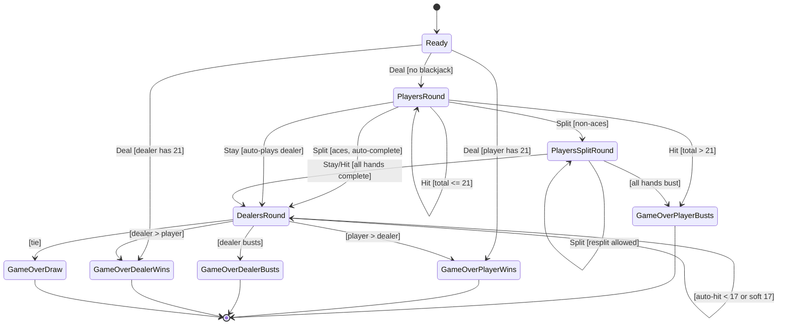

# Game Logic

This document describes the blackjack game state machine and scoring rules.

## State Machine

The game progresses through states defined by `GameNode` enum (`src/blackjack-game.h:154-164`).

## State Transitions

| Current State | Action | Condition | Next State |
|---------------|--------|-----------|------------|
| Ready | Deal | player == 21 | GameOverPlayerWins |
| Ready | Deal | dealer == 21 | GameOverDealerWins |
| Ready | Deal | neither == 21 | PlayersRound |
| PlayersRound | Hit | total <= 21 | PlayersRound |
| PlayersRound | Hit | total > 21 | GameOverPlayerBusts |
| PlayersRound | Stay | - | DealersRound (auto-plays) |
| PlayersRound | Split | matching pair, non-aces | PlayersSplitRound |
| PlayersRound | Split | matching aces | DealersRound (auto-plays) |
| PlayersSplitRound | Hit | not bust | PlayersSplitRound |
| PlayersSplitRound | Hit | bust, hands remain | PlayersSplitRound (next hand) |
| PlayersSplitRound | Hit | all bust | GameOverPlayerBusts |
| PlayersSplitRound | Stay | hands remain | PlayersSplitRound (next hand) |
| PlayersSplitRound | Stay | all complete | DealersRound (auto-plays) |
| PlayersSplitRound | Split | can resplit | PlayersSplitRound |
| DealersRound | auto | dealer < 17 | DealersRound (hit) |
| DealersRound | auto | soft 17 && hit_soft_17 | DealersRound (hit) |
| DealersRound | auto | dealer >= 17 (hard) | GameOver (comparison) |

## Scoring Rules

Hand values are calculated by `calculate_hand_value()` (`src/blackjack-game.cpp:9-39`):

| Card | Value |
|------|-------|
| 2-10 | Face value (2-10) |
| Jack, Queen, King | 10 |
| Ace | 11 (or 1 if 11 would bust) |

### Soft Ace Handling

The `HandValue` struct (`src/blackjack-game.h:13-17`) tracks:
- `total` - Final calculated total (after soft ace adjustment)
- `is_soft` - True if an Ace is currently counted as 11
- `soft_ace_count` - Number of Aces counted as 11

Algorithm (`src/blackjack-game.cpp:9-39`):
1. Count all aces as 11 initially
2. While total > 21 and soft aces remain:
   - Reduce one ace from 11 to 1 (subtract 10)
   - Decrement soft ace count
3. Return final total with soft status

Example: A, A, 9
- Initial: 11 + 11 + 9 = 31 (2 soft aces)
- Reduce one ace: 31 - 10 = 21 (1 soft ace)
- Result: 21, is_soft=true

## Hand Classes

### DealersHand

Simple container for dealer's cards (`src/blackjack-game.h:29-49`):
- `cards()` - Get the cards
- `add(Card)` - Add a card
- `value()` - Returns HandValue with soft ace logic
- `total()` - Returns the hand's total value
- `is_soft()` - Returns true if hand is soft

### PlayersHand

Multi-hand container supporting splits (`src/blackjack-game.h:51-152`):

#### SingleHand struct (`src/blackjack-game.h:54-68`)
- `cards` - The cards in this hand
- `is_from_split` - True if this hand came from a split
- `is_from_split_aces` - True if split from aces (one card only)
- `is_complete` - True if hand is done (stayed, busted, or split aces)
- `split_count` - Number of times this hand has been split (max 3)

#### PlayersHand methods
- `active_cards()` - Get active hand's cards
- `add_to_active(Card)` - Add card to active hand
- `active_total()` - Get active hand's total
- `active_is_busted()` - Check if active hand > 21
- `can_split(bool)` - Check if active hand can split
- `split(Card, Card)` - Split active hand, deal new cards
- `mark_active_complete()` - Mark active hand as done
- `advance_to_next_incomplete()` - Move to next playable hand
- `all_complete()` - Check if all hands are done
- `all_busted()` - Check if all hands busted
- `hand_count()` - Number of hands (1-4)
- `active_index()` - Index of currently active hand
- `all_hands()` - Get all SingleHand data

## Dealer Auto-Play

When the player stays (or all split hands complete), the dealer automatically plays via `play_dealer_turn()` (`src/blackjack-game.cpp:204-239`):

- **Must hit** on 16 or less
- **Must hit** on soft 17 if `BlackjackConfig::hit_soft_17` is true (default)
- **Must stand** on hard 17 or higher

The method loops until dealer busts or stands, then compares totals.

## Split Functionality

When the player has two cards of the same rank, they can split (`src/blackjack-game.cpp:93-113`, `src/blackjack-game.cpp:160-187`):

1. Two hands are created from the original pair
2. Each hand receives one additional card from the deck
3. **Split Aces Rule**: Split aces receive only one card each and cannot be hit
4. Player plays each hand sequentially (hand 0, then hand 1, etc.)
5. **Resplit**: Can split up to 3 times (4 total hands) if `split_count < 3`
6. **Resplit Aces**: Controlled by `BlackjackConfig::allow_resplit_aces` (default false)
7. 21 after split is NOT blackjack (just 21)
8. Dealer compares against all non-busted hands

## Player Actions

Defined in `Game::Play` enum (`src/blackjack-game.h:216`):

- **Deal** - Start the game, deal initial cards (2 to player, 2 to dealer)
- **Hit** - Draw another card to active hand
- **Stay** - End turn on active hand (triggers dealer auto-play if all complete)
- **Split** - Split matching pair into two hands

## Configuration

`BlackjackConfig` struct (`src/blackjack-game.h:206-211`):

| Field | Default | Purpose |
|-------|---------|---------|
| `hit_soft_17` | `true` | Dealer hits on soft 17 (standard casino rule) |
| `allow_resplit_aces` | `false` | Allow resplitting aces (RSA vs NRSA) |
| `initial_deck` | `nullopt` | Deterministic deck for testing |

## History Tracking

The `Game` class maintains a `vector<GameState>` history (`src/blackjack-game.h:234`). Each state transition appends a new immutable `GameState` to this history. The current state is always `history.back()`.

## File References

- HandValue struct: `src/blackjack-game.h:13-23`
- DealersHand class: `src/blackjack-game.h:29-49`
- PlayersHand class: `src/blackjack-game.h:51-152`
- GameNode enum: `src/blackjack-game.h:154-164`
- GameState struct: `src/blackjack-game.h:166-204`
- BlackjackConfig struct: `src/blackjack-game.h:206-211`
- Game class: `src/blackjack-game.h:213-235`
- calculate_hand_value(): `src/blackjack-game.cpp:9-39`
- add_em_up(): `src/blackjack-game.cpp:41-44`
- Game::next() state machine: `src/blackjack-game.cpp:46-202`
- play_dealer_turn(): `src/blackjack-game.cpp:204-239`
