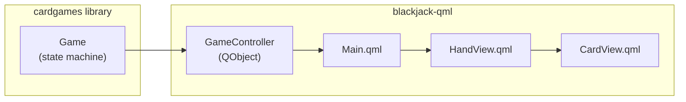

# QML Frontend

This document describes the optional Qt6/QML graphical frontend for the blackjack game.

## Overview

The QML frontend is an optional build target that provides a graphical user interface using Qt6 Quick. It depends on the `cardgames` library but is not required for the core game functionality.

## Build

Requires Qt 6.8+ installed via vcpkg, system package manager, or Qt installer.

```sh
# Install Qt via vcpkg (if not using system Qt)
vcpkg install qtbase:x64-windows qtdeclarative:x64-windows  # Windows
vcpkg install qtbase:x64-linux qtdeclarative:x64-linux      # Linux

# Windows
cmake --preset windows-qml -DCMAKE_TOOLCHAIN_FILE=$VCPKG_ROOT/scripts/buildsystems/vcpkg.cmake
cmake --build --preset windows-qml-release

# Linux (GCC)
cmake --preset linux-qml -DCMAKE_TOOLCHAIN_FILE=$VCPKG_ROOT/scripts/buildsystems/vcpkg.cmake
cmake --build --preset linux-qml-release

# Linux (Clang)
cmake --preset linux-clang-qml -DCMAKE_TOOLCHAIN_FILE=$VCPKG_ROOT/scripts/buildsystems/vcpkg.cmake
cmake --build --preset linux-clang-qml-release
```

**Windows deployment** (required to run outside IDE):
```sh
windeployqt --qmldir app/qml build-win-qml/Release/blackjack-qml.exe
```

**Requirements:** Qt6 with Core, Gui, Quick, and Qml modules.

## File Structure

```
app/qml/
├── CMakeLists.txt          # QML executable and module definition
├── GameController.h        # Qt bridge class header
├── GameController.cpp      # Qt bridge class implementation
├── main.cpp                # Application entry point
├── Main.qml                # Application window and layout
├── CardView.qml            # Single card visual component
└── HandView.qml            # Row of cards component
```

## Architecture



## GameController

The `GameController` class (`app/qml/GameController.h:12-68`) bridges the C++ `Game` state machine to QML using Qt's property system.

### Properties (Q_PROPERTY)

| Property | Type | Description |
|----------|------|-------------|
| `gameState` | `QString` | Current state as string ("ready", "playersTurn", etc.) |
| `playerHand` | `QVariantList` | Player's active hand cards as list of {suit, rank} objects |
| `dealerHand` | `QVariantList` | Dealer's cards as list of {suit, rank} objects |
| `playerScore` | `int` | Player's active hand value |
| `dealerScore` | `int` | Dealer's hand value |
| `canDeal` | `bool` | True when Deal action is valid |
| `canHit` | `bool` | True when Hit action is valid |
| `canStay` | `bool` | True when Stay action is valid |
| `canSplit` | `bool` | True when Split action is valid |
| `isGameOver` | `bool` | True when game has ended |
| `isSplitRound` | `bool` | True when playing split hands |
| `handCount` | `int` | Number of player hands (1-4) |
| `activeHandIndex` | `int` | Index of currently active hand |
| `playerHands` | `QVariantList` | All player hands with per-hand data |
| `resultMessage` | `QString` | Win/lose/draw message |

### Slots

| Slot | Description |
|------|-------------|
| `deal()` | Start game, deal initial cards |
| `hit()` | Draw another card |
| `stay()` | End player turn, triggers dealer auto-play when all hands complete |
| `split()` | Split matching pair into two hands |
| `newGame(deckName)` | Reset to initial state, optionally with a named test deck |

### Signals

- `gameStateChanged()` - Emitted when game state transitions
- `handsChanged()` - Emitted when cards are dealt

## QML Components

### Main.qml

Application window containing:
- Dealer's hand display (first card hidden during play)
- Status message
- Player's hand display with score
- Action buttons (Deal, Hit, Stay, Split, New Game)

### CardView.qml

Single card visual component with properties:
- `rank` - Card rank string ("2"-"10", "J", "Q", "K", "A")
- `suit` - Card suit string ("hearts", "diamonds", "clubs", "spades")
- `faceDown` - Boolean to show card back

Displays Unicode suit symbols (♥♦♣♠) with appropriate colors.

### HandView.qml

Row layout of `CardView` components with properties:
- `cards` - Array of {rank, suit} objects
- `hideFirst` - Boolean to show first card face-down

## Dealer Auto-Play

The dealer's turn is handled automatically by `Game::play_dealer_turn()` in the core library (`src/blackjack-game.cpp:208-245`). When the player stays (or all split hands complete), the game state machine automatically plays the dealer's hand according to configurable rules (hit on soft 17, etc.) and returns the final game-over state. The GameController simply delegates to `Game::next(Stay)` and emits state change signals.

## File References

- GameController class: `app/qml/GameController.h`
- Card-to-QVariant conversion: `app/qml/GameController.cpp`
- Dealer AI: `app/qml/GameController.cpp` (runDealerTurn method)
- Main QML layout: `app/qml/Main.qml`
- Card component: `app/qml/CardView.qml`
- Hand component: `app/qml/HandView.qml`
